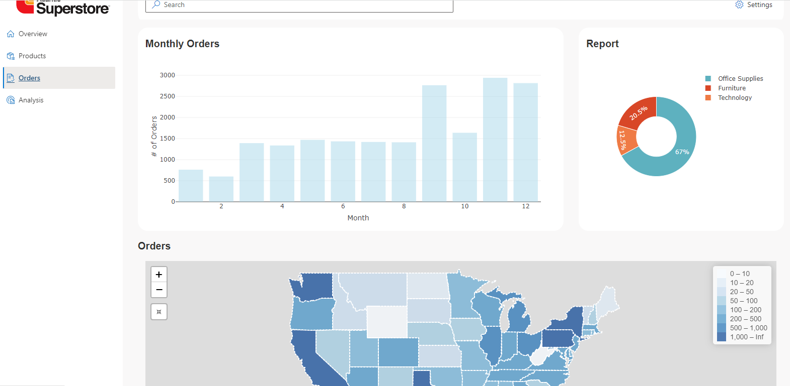
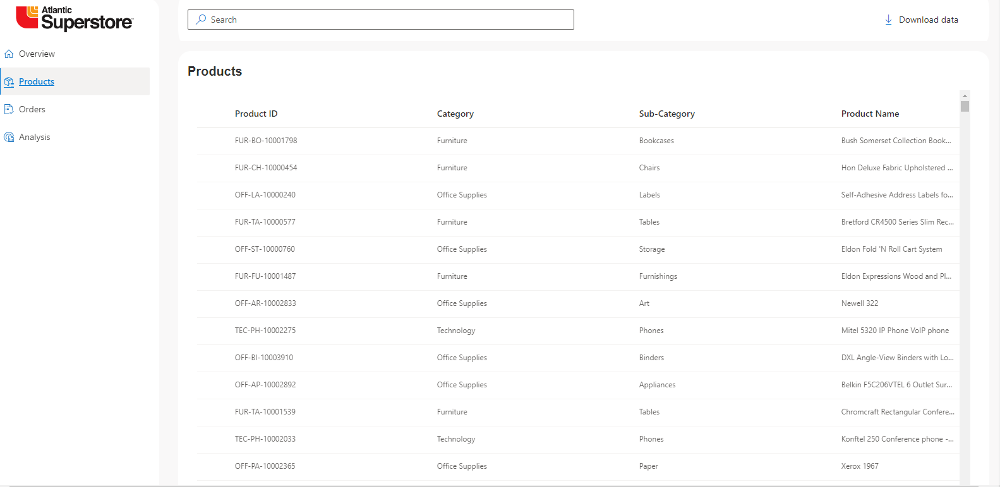

# RShiny-superstore-dashboard
## Technologies
Project is created with:
* Azure SQL Database Server
* RShiny/R.fluent (Microsoft Fluent UI)/R.react (react.js)
* HTML/CSS

## Data Source
* Data.world (https://data.world/stanke/superstore-20214)

